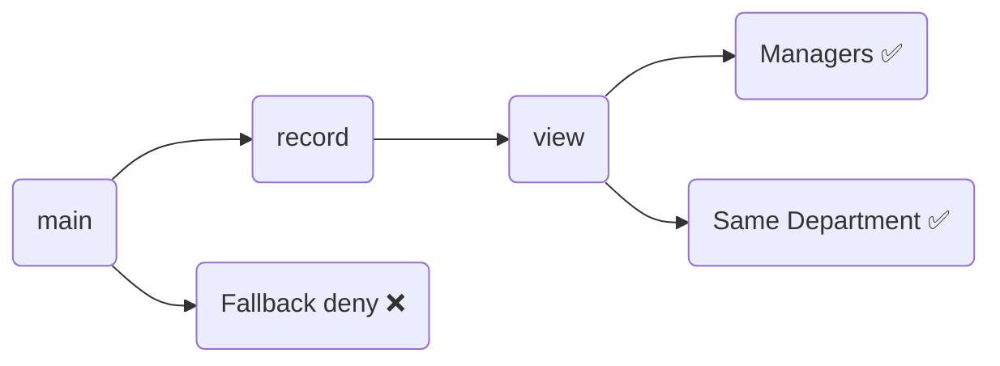

# What is OpenID AuthZEN?
OpenID AuthZEN is an OpenID Foundation working group and standard that creates a universal JSON-based API for fine-grained authorization decisions. It was co-founded by several members including [Axiomatics](https://www.axiomatics.com).

# What does this repository contain?
This repository contains
1. A series of sample requests/responses adhering to the [OpenID AuthZEN standard 1.0](https://openid.github.io/authzen/).
2. A series of equivalent requests/responses adhering to the XACML/JSON and XACML/REST Profiles of XACML 3.0
3. A sample [ALFA](https://alfa.guide) policy

# The sample policy

https://github.com/davidjbrossard/authzen/blob/3af1adcd023e0631b2253bab74bbc41e9c7ac82e/src-alfa/policy.alfa#L1-L85

## Overview

## Visualization

