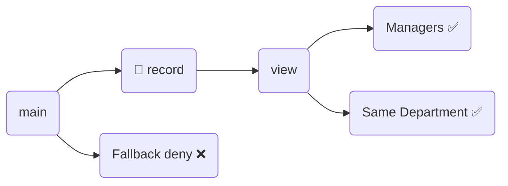

# What is OpenID AuthZEN?
OpenID AuthZEN is an OpenID Foundation working group and standard that creates a universal JSON-based API for fine-grained authorization decisions. It was co-founded by several members including [Axiomatics](https://www.axiomatics.com).

# What does this repository contain?
This repository contains
1. A series of sample requests/responses adhering to the [OpenID AuthZEN standard 1.0](https://openid.github.io/authzen/).
2. A series of equivalent requests/responses adhering to the XACML/JSON and XACML/REST Profiles of XACML 3.0
3. A sample [ALFA](https://alfa.guide) policy

## Repository layout
- `conf/` contains the Axiomatics domain configuration and license file setup.
- `src-alfa/` contains the example ALFA policy and supporting files.
- `bruno/` contains sample HTTP requests for local validation and testing.
- `deployment.yaml` contains the deployment/runtime configuration for the Access Decision Service.

## Required environment variables
This project expects configuration values to be passed through environment variables rather than being committed to source control.

The current deployment configuration references the following values:

- `ADS_LICENSE_PATH` – path to the Axiomatics license file
- `ADS_DOMAIN_PATH` – path to the domain YAML file
- `ADS_CLIENT_SECRET` – OAuth client secret used by the ADS client registration
- `ADS_PASSWORD` – password for the ADS service user
- `ADS_AUTHZ_PORT` – port for the authorization service (defaults to `8080`)

Example:

```bash
export ADS_LICENSE_PATH=./conf/
export ADS_DOMAIN_PATH=./conf/domain.yaml
export ADS_CLIENT_SECRET=your-client-secret
export ADS_PASSWORD=your-password
export ADS_AUTHZ_PORT=8080
```

## Quick start
Use the following minimal flow for a local run:

```bash
export ADS_LICENSE_PATH=./conf/
export ADS_DOMAIN_PATH=./conf/domain.yaml
export ADS_CLIENT_SECRET=your-client-secret
export ADS_PASSWORD=your-password
export ADS_AUTHZ_PORT=8080

java -jar access-decision-service-26.2.0-preview.jar server deployment.yaml

# Then test the AuthZEN endpoints using the requests under bruno/
```

## Local setup
1. Ensure the license file is present in the configured `conf/` directory.
2. Confirm the domain file exists at the path defined by `ADS_DOMAIN_PATH`.
3. Export the required environment variables listed above.
4. Start the Access Decision Service using the configured deployment/runtime setup.
5. Use the requests in `bruno/` to test AuthZEN and XACML-style policy evaluation flows.

## Security notes
- Do not commit real secrets, tokens, or passwords to git.
- Prefer environment variables or a secret manager over hard-coded configuration values.
- Keep the license file and any deployment secrets outside of source control.
- Review the generated `bruno` collection to ensure it does not include literal credentials.
- Treat `ADS_PASSWORD` and `ADS_CLIENT_SECRET` as sensitive runtime values and avoid logging them in terminal output, CI pipelines, or debug logs.

# The sample policy

https://github.com/davidjbrossard/authzen/blob/3af1adcd023e0631b2253bab74bbc41e9c7ac82e/src-alfa/policy.alfa#L1-L85

## Overview
This sample policy defines a simple authorization model for record access. The policy applies a default deny rule unless a specific permission allows access. In practice, the policy allows a user to view a record when either:

- the user has the role `manager`, or
- the user belongs to the same department as the record.

The rule is scoped to resources where `resource.Type == "record"` and actions where `action.name == "view"`. If access is denied, the policy records an advisory reason containing the user role, department, action, resource type, and record department so the denial is traceable.

## Visualization

```mermaid
  graph LR;
      A("main")-->B;
      B("🎯 record")-->C;
      C("view")-->D1("Managers ✅");
      C("view")-->D2("Same Department ✅");
      A("main")-->E("Fallback deny ❌")
```
